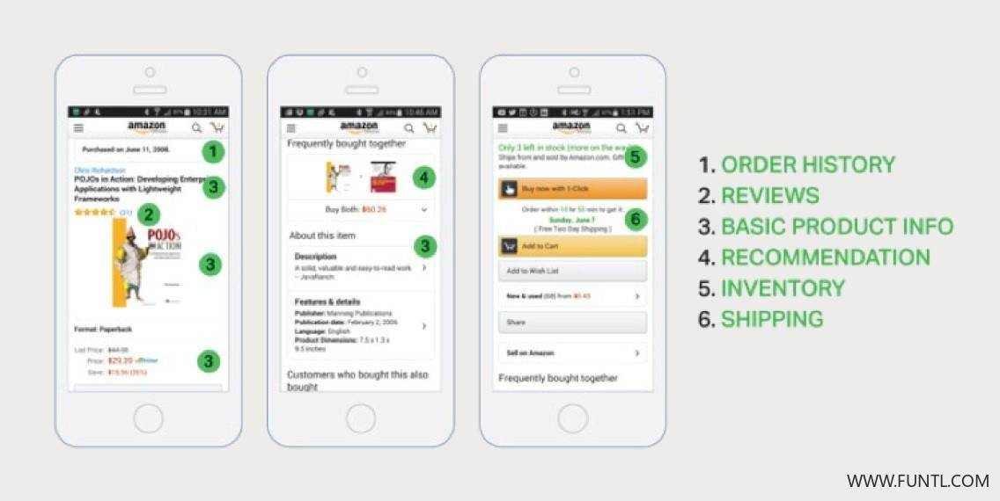
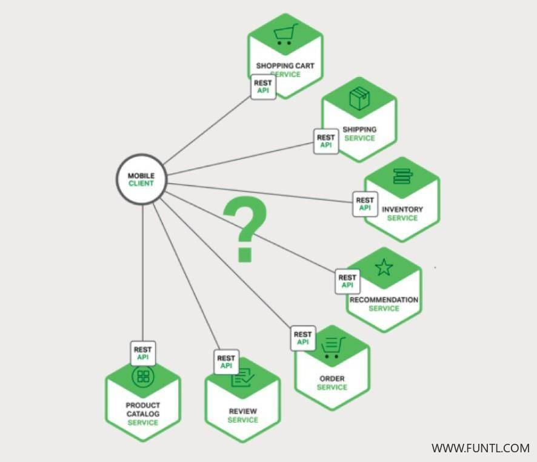

# 简介

我们假设您正在为一个购物应用开发一个原生移动客户端。

您可能需要实现一个产品详细信息页面，用于展示给定商品的信息。

例如，下图展示了在 Amazon 的 Android 移动应用中滚动产品信息时所看的内容。



这是一个智能手机应用，产品详细信息页面展示了许多信息。不仅有基本的产品信息，如名称、描述和价格，页面还展示了：

- 购物车中的物品数量
- 订单历史
- 客户评价
- 低库存警告
- 配送选项
- 各种推荐，包括了购买此产品的客户购买的其他产品
- 选择性购买选项

在使用单体应用架构的情况下，移动客户端通过对应用程序进行单个 REST 调用来检索此数据，例如：

```http
GET api.company.com/productdetails/productId
```

负载均衡器将请求路由到几个相同应用程序实例中的其中一个。之后，应用程序查询各个数据库表并返回响应给客户端。

相比之下，当使用微服务架构时，产品详细页面上展示的数据来自多个微服务。

以下是一些微服务， 可能拥有特定产品页面展示的数据：

- **订单服务** 订单历史
- **目录（ catalog）服务** 基本的产品信息，如产品名称、图片和价格
- **评价服务** 客户评价
- **库存服务** 低库存警告
- **配送服务** 配送选项、期限和费用，由配送方的 API 单独提供
- **推荐服务** 推荐类目



我们需要决定移动客户端如何访问这些服务。让我们来看看有哪些方法。