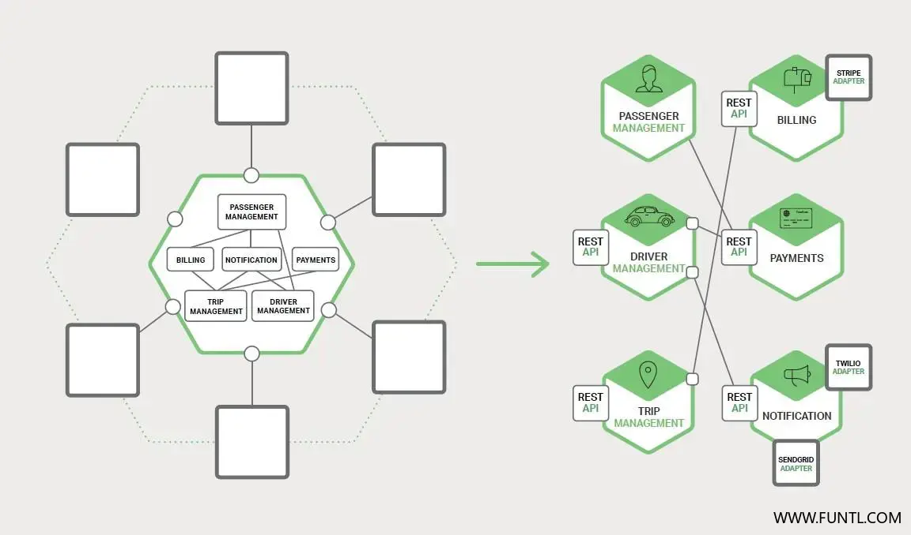
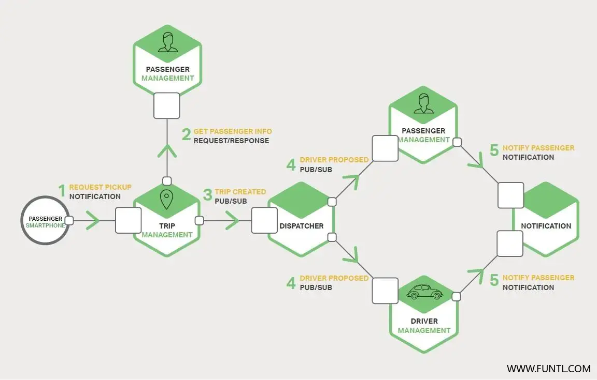
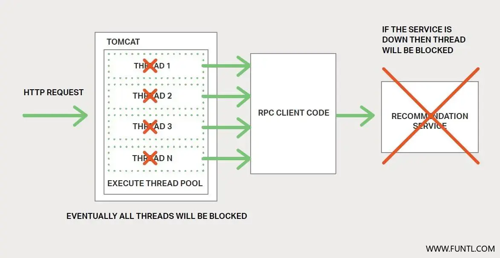
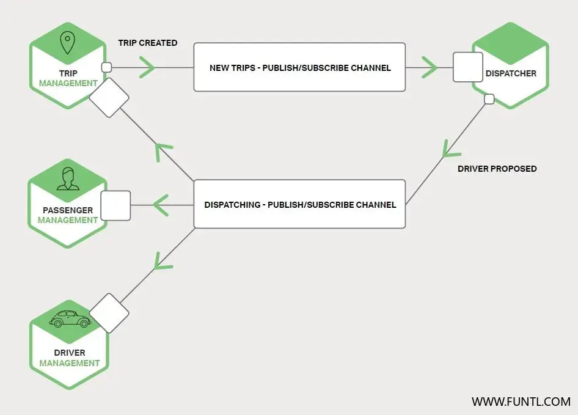

# 简介

在单体应用程序中，组件可通过语言级方法或者函数相互调用。相比之下，基于微服务的应用程序是一个运行在多台机器上的分布式系统。通常，每个服务实例都是一个进程。

因此，服务必须使用进程间通信（IPC）机制进行交互，如下图所示。

稍后我们将了解到多种 IPC 技术，但在此之前，我们先来探讨一下涉及到的各种设计问题。

# 交互方式

当为服务选择一种 IPC 机制时，首先需要考虑服务如何交互。有许多种客户端 — 服务交互方式。它们可以分为两个类。

第一类是一对一交互与一对多交互：

- **一对一** 每个客户端请求都由一个服务实例处理。
- **一对多** 每个请求由多个服务实例处理。

第二类是同步交互与异步交互：

- **同步** 客户端要求服务及时响应，在等待过程中可能会发生阻塞。
- **异步** 客户端在等待响应时不会发生阻塞，但响应（如果有）不一定立即返回。

下表展示了各种交互方式。

|      | 一对一    | 一对多        |
| ---- | --------- | ------------- |
| 同步 | 请求/响应 | -             |
| 异步 | 通知      | 发布/订阅     |
| 异步 | 请求/响应 | 发布/异步响应 |

一对一交互分为以下列举的类型，包括同步（请求/响应） 与异步（通知与请求/异步响应）：

- **请求/响应** 客户端向服务发出请求并等待响应。客户端要求响应及时到达。在基于线程的应用程序中，发出请求的线程可能在等待时发生阻塞。

- **通知（又称为单向请求）** 客户端向服务发送请求，但不要求响应。
- **请求/异步响应** 客户端向服务发送请求，服务异步响应。客户端在等待时不发生阻塞，适用于假设响应可能不会立即到达的场景。

一对多交互可分为以下列举的类型，它们都是异步的：

- **发布/订阅客户端** 发布通知消息，由零个或多个感兴趣的服务消费。
- **发布/异步响应** 客户端发布请求消息， 之后等待一定时间来接收消费者的响应。

通常，每个服务都组合着使用这些交互方式。对于一些服务而言，单一的 IPC 机制就足够了，但其他服务可能需要组合多个 IPC 机制。

下图显示了当用户请求打车时，打车应用中的服务可能会发生交互。

服务使用了通知、请求/响应和发布/订阅组合。

例如，乘客的智能手机向 Trip Management 微服务发送一条通知以请求一辆车。 

Trip Management 服务通过使用请求/响应来调用 Passenger Management 服务以验证乘客的帐户是否可用。

之后，Trip Management 服务创建路线，并使用发布/订阅通知其他服务，包括用于定位可用司机的 Dispatcher。

现在我们来看一下交互方式，我们先来看看如何定义 API。

# 定义 API

服务 API 是服务与客户端之间的契约。无论您选择何种 IPC 机制，使用接口定义语言（ interface definition language， IDL） 来严格定义服务 API 都是非常有必要的。

有论据证明使用 **API 优先法** 定义服务更加合理：就是说在对需要实现的服务 API 定义进行迭代之后，，您可以通过编写接口定义并与客户端开发人员进行审阅来开始开发服务，先迭代接口后审阅开发。这样设计可以增加您的成功机率， 以构建出符合客户端需求的服务。

正如您将会在后面看到，定义 API 的方式取决于您使用何种 IPC 机制。 

如果您正在使用消息传递，那么 API 是由消息通道和消息类型组成。如果您使用的是 HTTP，那么API 是由 URL、请求和响应格式组成。

稍后我们将详细地介绍关于 IDL 方面的内容。

# 演化 API

服务 API 总是随着时间而变化。

正是由于API的变化，旧版的客户端（调用者）可能就不支持新的API，更新所有客户端（调用者）就很有必要。

在单体应用程序中，更改 API 和更新所有调用者通常是一件直截了当的事。但在基于微服务的应用程序中，即使 API 的所有消费者都是同一应用程序中的其他服务，要想完成这些工作也是非常困难的。通常，您无法强制所有客户端与服务升级的节奏一致。

此外，您可能需要 **逐步部署服务的新版本**，以便新旧版本的服务同时运行。 

因此， 制定这些问题的处理策略还是很重要的。

处理 API 变更的方式取决于变更的程度。

某些更改是次要或需要向后兼容以前的版本。例如，您可能会向请求或响应添加属性。此时设计客户端与服务遵守 **鲁棒性原则** 就显得很有意义了。

> 鲁棒性原则的简单例子为：由于服务发生了更改，所以使用旧 API 的客户端使用的也是新版本的服务。服务更改时也更改了返回参数的数量，该服务就要为缺少的请求属性提供默认值，并且客户端忽略所有多余的响应属性。

使用 IPC 机制和消息格式非常重要，他们可以让您轻松地演化 API。

但有时候，您必须对 API 作出大量不兼容的更改。

因为您无法强制客户端立即升级，所以服务也必须支持一段时间的旧版本 API。

如果您使用了基于 HTTP 的机制（如REST），那么一种方法是将版本号嵌入 URL 中。每个服务实例可能同时处理多个版本。或者，您可以部署多个不同的实例，每个实例用于处理特定版本。

# 处理局部故障

正如第二章中关于 API 网关所述，在分布式系统中存在局部故障风险。

由于客户端进程与服务进程是分开的，服务可能无法及时响应客户端的请求。由于故障或者维护，服务可能需要关闭。也有可能因服务过载，造成响应速度变得极慢。

例如，请回想第二章中的产品详细信息场景。

我们假设 Recommendation Service 没有响应，客户端可能会无限期地阻塞以等待响应。这不仅会导致用户体验糟糕，而且在许多应用程序中，它将消耗如线程之类等宝贵资源。以致最终，在运行时将线程用完，造成无法响应，如下图所示。

为了防止出现此类问题，您必须设计您的服务以处理局部故障。

以下是一个由 Netflix 给出的好办法。处理局部故障的策略包括：

- **网络超时** 在等待响应时，不要无限期地阻塞，始终使用超时方案。使用超时方案确保资源不被无限地消耗。
- **限制未完成的请求数量** 对客户端拥有特定服务的未完成请求的数量设置上限。如果达到了上限，发出的额外请求可能是毫无意义的，因此这些尝试需要立即失败。
- **断路器模式** 追踪成功和失败请求的数量。如果错误率超过配置阈值，则断开断路器，以便后续的尝试能立即失败。如果出现大量请求失败，则表明服务不可用，发送请求将是无意义的。发生超时后，客户端应重新尝试，如果成功，则关闭断路器。
- **提供回退** 请求失败时执行回退逻辑。例如，返回缓存数据或者默认值，如一组空白的推荐数据。

Netflix Hystrix 是一个实现上述和其他模式的开源库。如果您正在使用 JVM，那么您一定要考虑使用 Hystrix。如果您在非 JVM 环境中运行，则应使用相等作用的库。

# IPC 技术

有多种 IPC 技术可供选择。

服务可以使用基于同步请求/响应的通信机制，比如基于 HTTP 的 REST 或 Thrift。

或者，可以使用异步、基于消息的通信机制，如 AMQP 或 STOMP。还有各种不同的消息格式。

服务可以使用人类可读、基于文本的格式，如 JSON 或 XML。或者，可以使用如 Avro 或 Protocol Buffers 等二进制格式（更加高效）。

稍后我们将讨论同步 IPC 机制，但在此之前让我们先来讨论一下异步 IPC 机制。

# 异步、基于消息的通信

当使用消息传递时，进程通过异步交换消息进行通信。

客户端通过发送消息向服务发出请求。如果服务需要回复，则通过向客户端发送一条单独的消息来实现。由于通信是异步的，因此客户端不会阻塞等待回复。相反，客户端被假定不会立即收到回复。

一条 **消息** 由头部（如发件人之类的元数据）和消息体组成。

消息通过 **通道** 进行交换。任何数量的生产者都可以向通道发送消息。类似地，任何数量的消费者都可以从通道接收消息。有两种通道类型，分别是 **点对点**（point‑to‑point）与 **发布订阅**（publish‑subscribe）：

- **点对点通道** 发送一条消息给一个切确的、正在从通道读取消息的消费者。服务使用点对点通道，就是上述的一对一交互方式。

- **发布订阅通道** 将每条消息传递给所有已订阅的消费者。服务使用发布订阅通道，就是上述的一对多交互方式。如下图

  

  Trip Management 服务通过向发布订阅通道写入 Trip Created 消息来通知已订阅的服务，如 Dispatcher。

  Dispatcher 找到可用的司机并通过向发布订阅通道写入 Driver Proposed 消息来通知其他服务。

有许多消息系统可供选择， 您应该选择一个支持多种编程语言的。一些消息系统支持标准协议，如 AMQP 和 STOMP。其他消息系统有专有的文档化协议。

有大量的开源消息系统可供选择，包括 **RabbitMQ**、**Apache Kafka**、**Apache ActiveMQ** 和 **NSQ**。从高层而言，他们都支持某种形式的消息和通道。他们都力求做到可靠、高性能和可扩展。然而，每个代理的消息传递模型细节上都存在着很大差异。

使用消息传递有很多优点：

- **将客户端与服务分离** 客户端通过向相应的通道发送一条消息来简单地发出一个请求。服务实例对客户端而言是透明的。客户端不需要使用发现机制来确定服务实例的位置。
- **消息缓冲** 使用如 HTTP 的同步请求/响应协议，客户端和服务在交换期间必须可用。相比之下，消息代理会将消息写入通道入队，直到消费者处理它们。这意味着，例如，即使订单执行系统出现缓慢或不可用的情况，在线商店还是可以接受客户的订单。订单消息只需要简单地排队。
- **灵活的客户端 — 服务交互** 消息传递支持前面提到的所有交互方式。
- **毫无隐瞒的进程间通信** 基于 RPC 的机制试图使调用远程服务看起来与调用本地服务相同。然而，由于物理因素和局部故障的可能性，他们实际上是完全不同的。消息传递使这些差异变得非常明显，所以开发人员不会被这些虚假的安全感所欺骗。

然而，消息传递也存在一些缺点：

- **额外的复杂操作** 消息传递系统是一个需要安装、配置和操作的系统组件。消息代理程序必须高度可用，否则系统的可靠性将受到影响。
- **实施基于请求/响应式交互的复杂性** 如果想通过基于消息的通信来实现请求/响应式交互，就需要额外做些工作来实现：每个请求消息必须包含应答通道标识符和相关标识符。该服务将包含相关 ID 的响应消息写入应答信道。客户端使用相关 ID 将响应与请求相匹配。通常使用直接支持请求/响应的 IPC 机制更加容易。

现在我们已经了解了使用基于消息的 IPC，让我们来看看请求/响应的 IPC。

# 同步的请求/响应 IPC

当使用基于**同步**、并且基于请求/响应的 IPC 机制时，客户端向服务器发送请求。该服务处理该请求并返回响应。

在许多客户端中，请求的线程在等待响应时被阻塞。不阻塞的客户端可能会使用异步、事件驱动的客户端代码，这些代码可能是由 Futures 或 Rx Observables 封装的。

然而，与使用消息传递不同，客户端假定响应能及时到达。

有许多协议可供选择。有两种流行协议分别是 REST 和 Thrift。我们先来看一下 REST。

## REST

如今，开发 **RESTful** 风格的 API 是很流行的。 REST 是一种使用了 HTTP（几乎总是）的 IPC 机制。

资源是 REST 中的一个关键概念，它通常表示业务对象，如客户、产品或这些业务对象的集合。 

REST 使用 HTTP 动词（谓词）来操纵资源，这些资源通过 URL 引用。

例如，GET 请求返回一个资源的表述形式，可能是 XML 文档或 JSON 对象形式。POST 请求创建一个新资源，PUT 请求更新一个资源。

> “REST 提供了一套架构约束，当应用作为整体时，其强调组件交互的可扩展性、接口的通用性、组件的独立部署以及中间组件，以减少交互延迟、实施安全性和封装传统系统。” — Roy Fielding，**《架构风格与基于网络的软件架构设计》**

下图展示了打车应用程序可能使用 REST 的方式之一

乘客的智能手机通过向 Trip Management 服务的 **/trips** 资源发出一个 POST 请求来请求旅程。该服务通过向 Passenger Management 服务发送一个获取乘客信息的 GET 请求来处理该请求。在验证乘客被授权创建旅程后， Trip Management 服务将创建旅程，并向智能手机返回 201 响应。

许多开发人员声称其基于 HTTP 的 API 就是 RESTful。然而，正如 Fielding 在这篇博文中所描述的那样，并不是都是这样。

Leonard Richardson 定义了一个非常有用的 **REST 成熟度模型**，包括以下层次：

- **级别 0** 的 API 的客户端通过向其唯一的 URL 端点发送 HTTP POST 请求来调用该服务。每个请求被指定要执行的操作、操作的目标（如业务对象）以及参数。
- **级别 1** 的 API 支持资源概念。要对资源执行操作，客户端会创建一个 POST 请求，指定要执行的操作和参数。
- **级别 2** 的 API 使用 HTTP 动词（谓词）执行操作：使用 GET 检索、使用 POST 创建和使用 PUT 进行更新。请求查询参数和请求体（如果有）指定操作的参数。这使服务能够利用到 Web 的基础特性，如缓存 GET 请求。
- **级别 3** 的 API 基于非常规命名原则设计，HATEOAS（Hypermedia as the engine of application state，超媒体即应用程序状态引擎）。基本思想是 GET 请求返回的资源的表述，包含用于执行该资源上允许的操作的链接。例如，客户端可以使用发送 GET 请求检索订单返回的订单响应中的链接来取消订单。 HATEOAS 的一个好处是不再需要将 URL 硬编码在客户端代码中。另一个好处是，由于资源的表示包含可允许操作的链接，所以客户端不必猜测可以对当前状态的资源执行什么操作。

使用基于 HTTP 的协议有很多好处：

- HTTP 简单易懂。
- 您可以使用浏览器扩展（如 **Postman**） 来测试 HTTP API，或者使用 curl 命令行测试 HTTPAPI（假设使用了 JSON 或其他一些文本格式）。
- 它直接支持请求/响应式通信。
- HTTP 属于防火墙友好。（HTTP可以直接通过防火墙）
- 它不需要中间代理，简化了系统架构。

使用 HTTP 也存在一些缺点：

- HTTP 仅直接支持请求/响应的交互方式。您可以使用 HTTP 进行通知，但服务器必须返回 HTTP 响应。
- 因为客户端和服务直接通信（没有一个中间者来缓冲消息），所以在交换期间，它们必须都运行着。
- 客户端必须知道每个服务实例的位置（即 URL）。如第二章关于 API 网关所述，这是现代应用程序中的一个复杂问题。客户端必须使用服务发现机制来定位服务实例。

开发人员社区最近重新发现了 RESTful API 接口定义语言的价值。有几个可以选择，包括 RAML 和 Swagger。 

一些 IDL（接口描述语言，如 Swagger）允许您定义请求和响应消息的格式。其他如 RAML，需要您使用一个单独的规范，如 JSON 模式。

除了用于描述 API 之外，IDL 通常还具有可从接口定义生成客户端 stub 和服务器 skeleton 的工具。

> [stub（存根）](https://whatis.techtarget.com/definition/stub)
>
> A stub is a **small program routine that substitutes（替代） for a longer program that possibly to be loaded later or that is located remotely**.
> For example, a program that uses Remote Procedure Calls ( RPC) is compiled with stubs that substitute for the program that provides a requested procedure（程序）. The stub accepts the request and then forwards it (through another program) to the remote procedure.
>
> 简单来说，stub就是存根就是能调用远程接口的一个客户端

## Thrift

Apache Thrift 是 REST 的一个有趣的替代方案。它是一个用于编写跨语言 RPC 客户端和服务器 skeleton。

> 要明确的是，Thrift是RPC，目前流行的RPC框架gRPC、Thrift、Dubbo

Thrift 提供了一个 C 风格的 IDL 来定义您的 API。您可以使用 Thrift 编译器生成客户端 stub 和服务器端 skeleton。编译器可以生成各种语言的代码，包括 C++、Java、Python、PHP、Ruby、Erlang 和 Node.js。

Thrift 接口由一个或多个服务组成。服务定义类似于一个 Java 接口。它是强类型方法的集合。

Thrift 方法可以返回一个（可能为 void）值，或者如果它们被定义为单向，则不会返回值。

返回值方法实现了请求/响应的交互方式，客户端等待响应，并可能会抛出异常。单向方式对应通知互动方式，服务器不回发响应。

Thrift 支持多种消息格式： JSON，二进制和压缩二进制。

二进制比 JSON 更有效率，因为其解码速度更快。而且，顾名思义，压缩二进制是一种节省空间的格式。当然，JSON 是人性化和浏览器友好的。

Thrift 还为您提供了包括原始 TCP 和 HTTP 在内的传输协议选择。原始 TCP 可能比 HTTP 更有效率。然而， HTTP 是防火墙友好的、浏览器友好的和人性化的。

# 消息格式

我们已经了解了 HTTP 和 Thrift，现在让我们来看看消息格式的问题。

如果您使用的是消息系统或 REST，则可以选择自己的消息格式。其他 IPC 机制如 Thrift 可能只支持少量的消息格式，甚至只支持一种。

在任一种情况下，使用跨语言消息格式就显得非常重要了。即使您现在是以单一语言编写您的微服务，您将来也可能会使用到其他语言。

有两种主要的消息格式：文本和二进制。

基于文本格式的例子有 JSON 和 XML。这些格式的优点在于，它们不仅是人类可读的，而且是自描述的。在 JSON 
中，对象的属性由键值对集合表示。类似地，在 XML 中，属性由命名元素和值表示。这使得消息消费者能够挑选其感兴趣的值并忽略其余的值。因此，可以轻松地向后兼容作出微小更改的消息格式。

XML 文档的结构由 XML 模式（ schema）指定。随着时间的推移，开发人员社区已经意识到 JSON 也需要一个类似的机制，一个选择是使用 JSON Schema，JSON Schema有两种：独立的、作为 IDL 一部分的（如 Swagger ）。

使用基于文本的消息格式的缺点是消息往往是冗长的，特别是 XML。因为消息是自描述的，每个消息除了它们的值之外还包含属性的名称。另一个缺点是解析文本的开销。因此，您可能需要考虑使用二进制格式。

有几种二进制格式可供选择。

如果您使用的是 Thrift RPC，您可以使用二进制 Thrift。

如果您选择的消息格式，包括了流行的 Protocol Buffers 和 Apache Avro，这两种格式都提供了一种用于定义消息结构的类型 IDL。然而，一个区别是 Protocol Buffers 使用标记字段，而 Avro 消费者需要知道模式才能解释消息。因此， Protocol Buffers 的 API 演化比 Avro 更容易使用。

# 总结

微服务必须使用进程间通信机制进行通信。在设计服务如何进行通信时，您需要考虑各种问题：服务如何交互、如何为每个服务指定 API、如何演变 API 以及如何处理局部故障。微服务可以使用两种 IPC 机制：异步消息传递和同步请求/响应。为了进行通信，一个服务必须能够找到另一个服务。