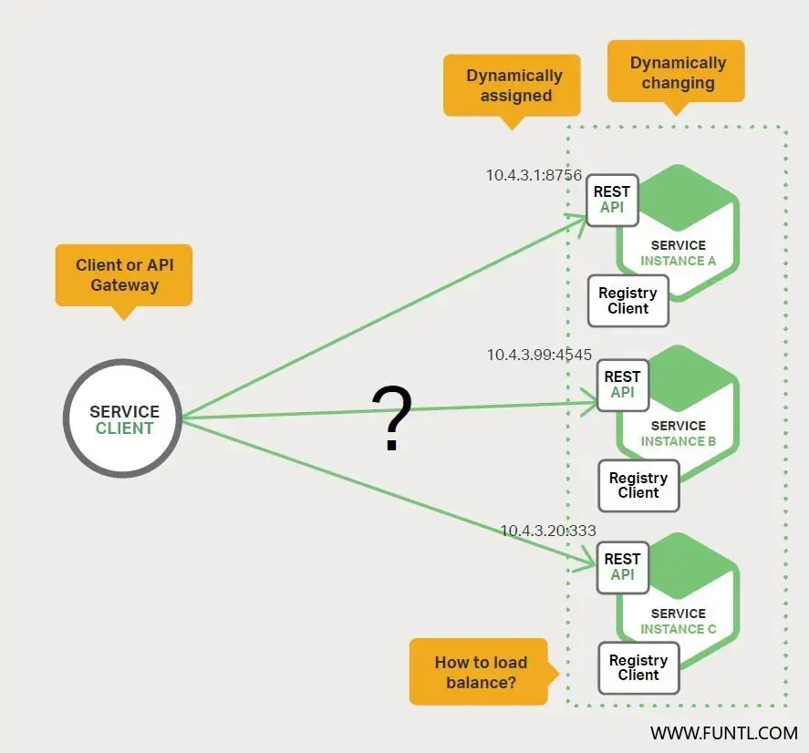

# 为何使用服务发现

我们假设您正在编写某些代码，这些代码调用了有 REST API 或 Thrift API 的服务。

为了发送一个请求，您的代码需要知道服务实例的网络位置（ IP 地址与端口）。在运行于物理硬件上的传统应用中，服务实例的网络位置是相对静态的。例如，您的代码可以从偶尔更新的配置文件中读取网络位置。

然而，在现代基于云的微服务应用中，这是一个更难解决的问题，服务实例具有动态分配的网络位置。此外，由于自动扩缩、故障与升级，整组服务实例地址会动态变更。因此，您的客户端代码需要使用更精确的服务发现机制。

有两种主要的服务发现模式：客户端发现（client-side discovery）与服务端发现（server-side discovery）。

让我们先来看看客户端发现。

# 客户端发现模式

正在补充……