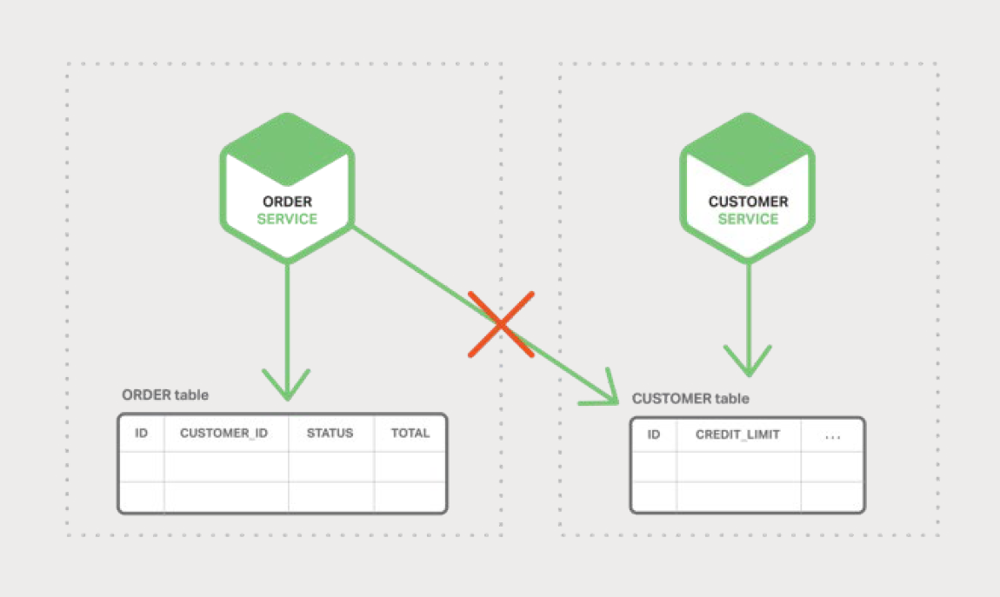
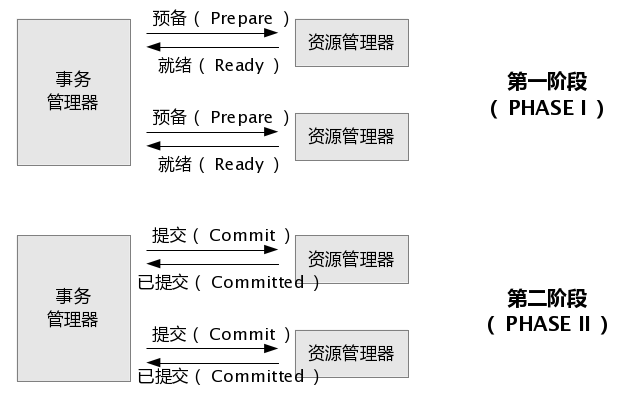
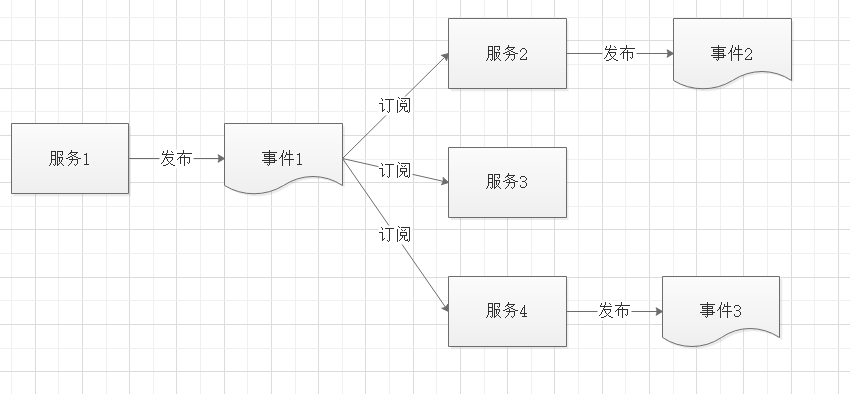
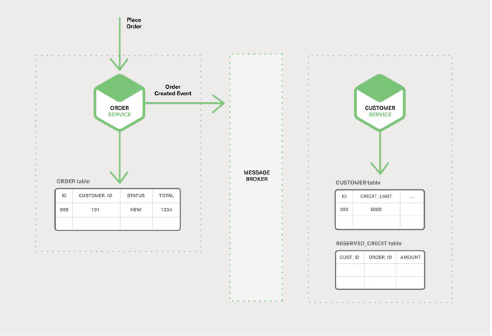
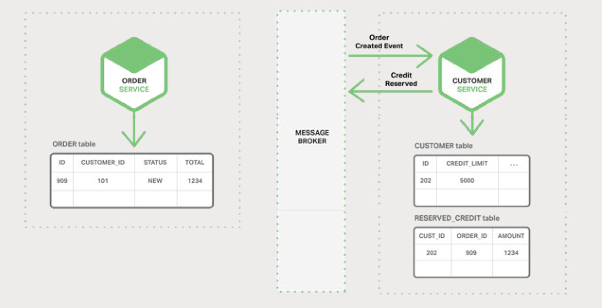
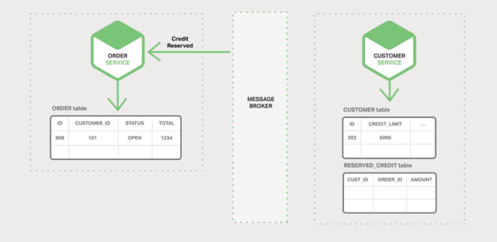
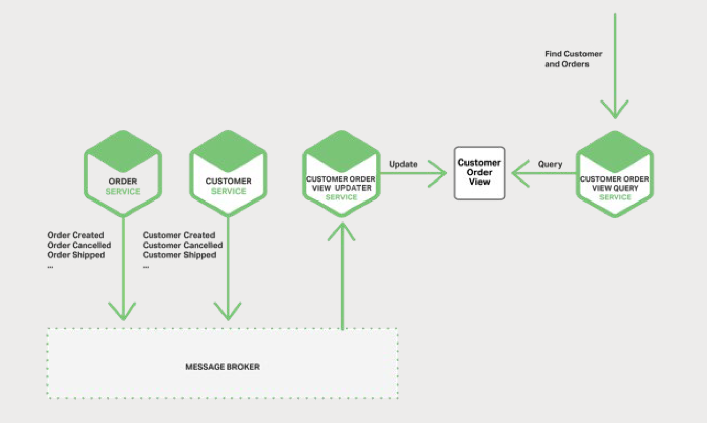

在本章中，我们稍微做了点调整，研究微服务架构中出现的分布式数据管理问题。

# 微服务和分布式数据管理问题
单体应用程序通常具有一个单一的关系型数据库。使用关系型数据库的一个主要优点是您的应用程序可以使用 [ACID 事务](https://en.wikipedia.org/wiki/ACID)，这些事务提供了以下重要保障：

- **原子性（Atomicity）** — 所作出的更改是原子操作，不可分割
- **一致性（Consistency）** — 数据库的状态始终保持一致
- **隔离性（Isolation）** — 即使事务并发执行，但他们看起来更像是串行执行
- **永久性（Durable）** — 一旦事务提交，它将不可撤销

因此，您的应用程序可以很容易地开始事务、更改（插入、更新和删除）多个行，并提交事务。

使用关系数据库的另一大好处是它提供了 SQL，这是一种丰富、声明式和标准化的查询语言。您可以轻松地编写一个查询来组合来自多个表的数据，之后，RDBMS 查询计划程序将确定执行查询的最佳方式。您不必担心如何访问数据库等底层细节。因为您所有的应用程序数据都存放在同个数据库中，因此很容易查询。

很不幸的是，当我们转向微服务架构时，数据访问将变得非常复杂。因为每个微服务所拥有的数据[对当前微服务来说是私有的](http://microservices.io/patterns/data/database-per-service.html)，只能通过其提供的 API 进行访问。封装数据可确保微服务松耦合、独立演进。如果多个服务访问相同的数据，模式（schema）更新需要对所有服务进行耗时、协调的更新。

更糟糕的是，不同的微服务经常使用不同类型的数据库。

现代应用程序存储和处理着各种数据，而关系型数据库并不总是最佳选择。在某些场景，特定的 NoSQL 数据库可能具有更方便的数据模型，提供了更好的性能和可扩展性。

例如，存储和查询文本的服务使用文本搜索引擎（如 Elasticsearch）是合理的。类似地，存储社交图数据的服务应该可以使用图数据库，例如 Neo4j。

因此，基于微服务的应用程序通常混合使用 SQL 和 NoSQL 数据库，即所谓的[混合持久化](http://martinfowler.com/bliki/PolyglotPersistence.html)（polyglot persistence）方式。

分区的数据存储混合持久化架构具有许多优点，包括了松耦合的服务以及更好的性能与可扩展性。然而，它也引入了一些分布式数据管理方面的挑战。

第一个挑战是如何实现业务的事务在多个服务之间保持一致性。要了解此问题，让我们先来看一个在线 B2B 商店的示例。Customer Service （顾客服务）维护客户相关的信息，包括信用额度。Order Service （订单）负责管理订单，并且必须验证新订单，不得超过客户的信用额度。在此应用程序的单体版本中，Order Service 可以简单地使用 ACID 事务来检查可用信用额度并创建订单。

相比之下，在微服务架构中，ORDER （订单）和 CUSTOMER （顾客）表对其各自的服务都是私有的，如图 5-1 所示：

Order Service 无法直接访问 CUSTOMER 表。它只能使用客户服务提供的 API。

订单服务可能使用了[分布式事务](https://en.wikipedia.org/wiki/Two-phase_commit_protocol)，也称为两阶段提交（2PC）。然而，2PC 在现代应用中通常是不可行的。

> [两阶段提交示意图：](https://www.jianshu.com/p/18b511c037a9)
>
> 

[CAP 定理](https://en.wikipedia.org/wiki/CAP_theorem) 定理要求您在可用性与 ACID 式一致性（强一致性）之间做出选择，可用性通常是更好的选择。此外，许多现代技术，如大多数 NoSQL 数据库，都不支持 2PC。

维护服务和数据库之间的数据一致性至关重要，因此我们需要另一套解决方案。

第二个挑战是如何实现从多个服务中检索数据。

例如，我们假设应用程序需要显示一个顾客和他最近的订单。如果 Order Service 提供了用于检索客户订单的 API，那么您可以使用应用程序端连接以检索数据。应用程序从 Customer Service 中检索客户，并从 Order Service 中检索客户的订单。

但是，假设 Order Service 仅支持通过主键查找订单（也许它使用了仅支持基于主键检索的 NoSQL 数据库）。在这种情况下，没有有效的方法来检索所需的数据。

# 事件驱动架构
许多应用使用了[事件驱动架构](https://martinfowler.com/eaaDev/EventNarrative.html)作为解决方案。

在此架构中，微服务在发生某些重要事件时发布一个事件，例如更新业务实体时。其他微服务订阅了这些事件，当微服务接收到一个事件时，它可以更新自己的业务实体，这可能导致更多的事件被发布。

您可以使用事件实现跨多服务的业务的事务。一个事务由一系列的步骤组成。每个步骤包括了微服务更新业务实体和发布一个事件来触发下一步骤。下图依次展示了如何在创建订单时使用事件驱动方法来检查可用信用额度。

微服务通过 Message Broker （消息代理）进行交换事件：

- Order Service（订单服务）创建一个状态为 NEW 的订单，表示订单创建中、还未获取到信用额度，并发布一个 OrderCreated（订单创建）事件。

  

- Customer Service （客户服务）消费了 Order Created 事件，为订单查询信用额度，成功后发布 Credit Reserved 事件。

  

- Order Service 消费了 Credit Reserved 事件并将订单的状态更改为 OPEN，表示订单的信用额度处理完成，订单也就完成了。

  

更复杂的场景可能会涉及额外的步骤，例如在检查客户信用的同时保留库存。

假设（a）每个服务原子地更新数据库并发布事件，稍后再更新，（b）Message Broker 保证事件至少被传送一次，您可以实现跨多服务的业务事务。需要注意的是，这些并不是 ACID 事务。它们只提供了更弱的保证，如[最终一致性](https://en.wikipedia.org/wiki/Eventual_consistency)。该事务模型称为 [BASE 模型](http://queue.acm.org/detail.cfm?id=1394128)。

属于多个微服务的数据构成的物化视图，你也可以用事件来维护。维护视图的服务订阅了相关事件并更新视图。

> [Materialized views（物化视图）](https://www.cnblogs.com/yuxiaoqi/p/3840262.html)
>
> 是已经被存储的或者说被物化-'materialized' 成 schema对象的查询结果。

图 5-5 展示了 Customer Order View Updater Service （客户订单视图更新服务）根据 Customer Service 和 Order Service 发布的事件更新 Customer Order View （客户订单视图）。

当 Customer Order View Updater Service 接收到 Customer 或 Order 事件时，它会更新 Customer Order View 数据存储。

您可以使用如 MongoDB 之类的文档数据库实现 Customer Order View，并为每个 Customer 存储一个文档。

Customer OrderView Query Service （客户订单视图查询服务）通过查询 Customer Order View 数据存储来处理获取一位客户和最近的订单的请求。

事件驱动的架构有几个优点与缺点。它能够实现跨越多服务并提供最终一致性的事务。另一个好处是它还使得应用程序能够维护[物化视图](https://en.wikipedia.org/wiki/Materialized_view)。

一个缺点是其编程模型比使用 ACID 事务更加复杂。通常，您必须实现补偿事务以从应用程序级别的故障中恢复。例如，如果信用检查失败，您必须取消订单。此外，应用程序必须处理不一致的数据。因为未提交的事务所做的更改是可见的。如果从未更新的物化视图中读取，应用程序依然可以看到不一致性。另一个缺点是订阅者必须要检测和忽略重复的事件。

# 实现原子性
更新中……
