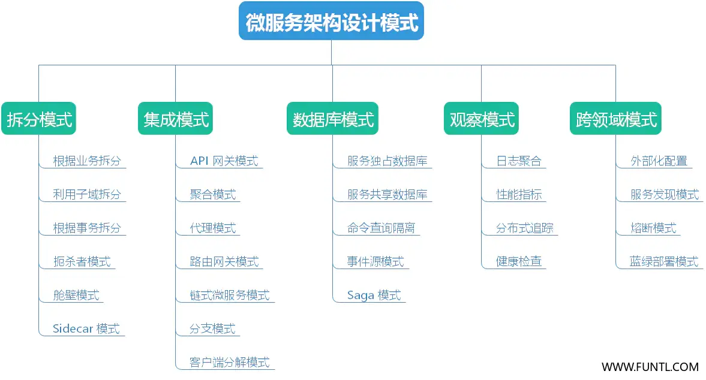
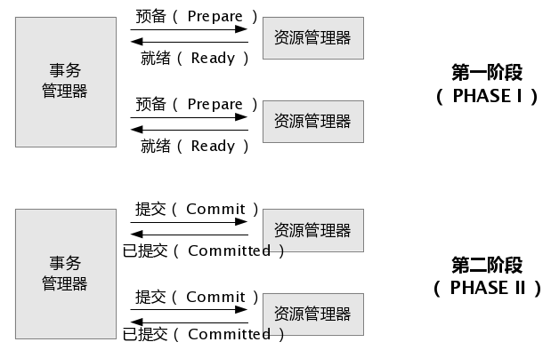

## 构建原则

### 概述

微服务能在企业中发挥积极作用。因此了解微服务架构（MSA）设计的一般目标或原则，以及一些微服务的设计模式，都是是很有意义的

- **降低成本**：MSA 降低了 IT 服务的设计、实现和管理的总体成本
- **提高交付速度**：MSA 能够提高服务的实现速度
- **增强健壮性**：MSA 能够增强我们服务网络的健壮性
- **提供可视化支持**：MSA 能够为服务和网络提供更好的可视化支持

### 微服务架构的构建原则

- 伸缩能力
- 可用性
- 健壮性
- 弹性
- 独立的匿名服务
- 去中心化的治理
- 故障隔离
- 自动供给
- 通过 DevOps 实现持续交付

在系统建设中，坚持上述原则会遭遇很多挑战和问题。这些问题在很多解决方案中都会出现。如果能够正确的使用合适的设计模式，就能够克服这些问题。

微服务的设计模式可以分为五大类，每个大类中都包含一些设计模式

## 拆分模式

### 根据业务拆分

**根据业务能力进行分解的方式，能降低服务耦合度，实现单一职责的服务目标**。

这里说的业务能力是来自业务架构模型的一个概念，是企业用来创造价值的行为。

业务能力通常对应到业务对象上，例如：

- 订单管理负责订单
- 客户管理负责客户

### 利用子域拆分

使用业务能力对应用进行拆分是个好的开端，但是往往会遇到不易分解的超级类。这种超级类在很多服务中都很普遍。

用 DDD 子域来进行服务的定义。DDD 把应用的问题空间（业务）当作领域。一个领域由多个子域构成。每个子域负责业务的不同部分。子域可以分为几类：

- **核心：** 业务中的关键差异因素，也是应用程序中的价值核心
- **支撑：** 和业务有关，但并非关键差异；可以自建，也可以外包
- **通用：** 并不针对业务，理想情况下，可以使用现成的软件实现

订单管理的子域包括：

- 产品类目服务
- 库存管理服务（支撑）
- 订单管理服务（核心）
- 配送管理服务（通用）

### 根据事务拆分

这种模式可以分解事务上的服务，这样系统中就会有会有多个事务。

分布式事务中的一个重要概念就是事务协调者。**分布式事务 (两阶段提交)** 由两个步骤组成：

- **准备阶段：** 这个阶段中，事务的所有参与者都做好准备，并通知事务协调者，它们已经准备好完成事务
- **提交或归滚阶段：** 这个阶段里，事务协调者会向所有参与方发出提交或回滚命令

> **注意：** 相对于单一微服务来说，两段提交的问题就是慢。在微服务之间进行事务协调，就算是在同一网络中，也会拖慢系统；所以这种方式在高负载场景中并不常见

### 扼杀者模式

前面三个设计模式都是对 **绿地 (Greenfiled)** 应用进行拆分，但是还有 80% 的 **棕地 (Brownfiled)** 需要对付 —— 它们是传统、庞大的单体应用。

扼杀者模式为此而生。这种模式会创建两个独立的应用，一同运行在同样的 URI 空间中。随着时间点的推移，新的重构了的应用会扼杀或者替换掉原有应用，最后就可以关掉单体应用了。

这种模式分为 **转换**、**共存** 和 **终结** 三个步骤

> [杀手应用](https://tonited.gitee.io/blog/2020/05/11/chong-gou-dan-ti-ying-yong-wei-wei-fu-wu/#toc-heading-1)
>
> Martin Fowler 将这种应用现代化策略称为杀手应用（Strangler Application）。这个名字来自发现于热带雨林中的葡萄树（也称为绞杀榕）。
>
> 一棵葡萄树生长在一棵树上，以获取森林冠层之上的阳光。有时，树死了，留下一个树形的腾。
>
> 应用现代化也遵循相同的模式。我们将构建一个新的应用程序，包括了围绕遗留应用的微服务（它将会慢慢缩小或者最终消亡）。

### 舱壁模式

根据消费者的负载以及可用性要求，把服务分割为不同的群。这个模式可以类比船体结构，因此被称为舱壁。

这个模式把应用的元素隔离开来，这样一个失败之后，其它的还能继续工作。这种设计能够对故障进行隔离，即使遇到故障，也能为部分消费者提供服务

> **注：** 舱壁模式（Bulkhead）隔离了每个工作负载或服务的关键资源，如连接池、内存和 
> CPU，使用舱壁避免了单个工作负载（或服务）消耗掉所有资源，从而导致其他服务出现故障的场景.
>
> 这种模式主要是通过防止由一个服务引起的级联故障来增加系统的弹性（舱壁模式降低依赖服务对整个系统的影响，保护有限的资源不被耗尽，增加了系统得到弹性）

### Sidecar 模式

这种模式把应用的组件部署到另一个容器中，不和主应用的放在同一个容器中，从而更好地完成隔离和封装。这种模式让应用能够把多种组件和技术整合在一起。

这种模式的情况很像摩托车的挎斗，因此被称为 Sidecar，Sidecar 附着在主应用上，并且为主应用提供支持能力。

Sidecar 还和主应用共享同样的生命周期，它的创建和销毁都是和主应用同步进行的。

Sidecar 模式有时也被称为 Sidekick 模式

## 集成模式

更新中……