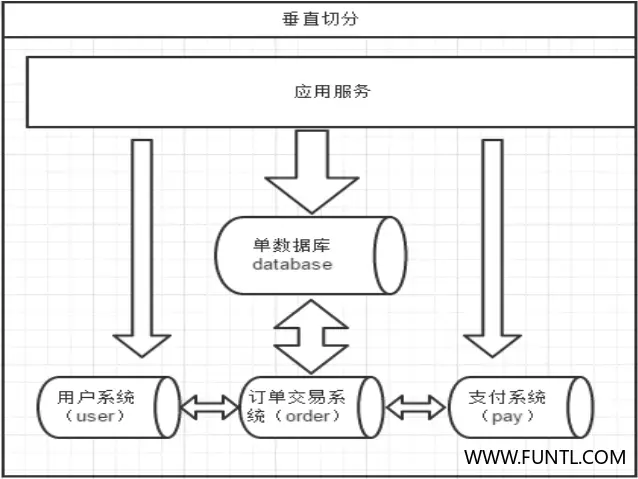
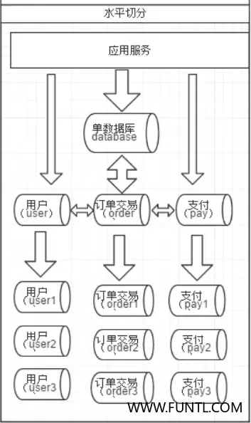
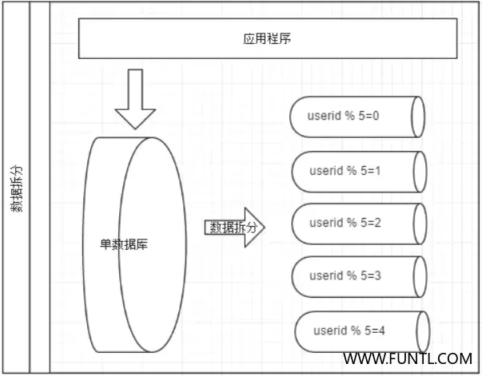

# 概述

Mycat 是什么？从定义和分类来看，它是一个开源的分布式数据库系统，是一个实现了 MySQL  协议的 Server，前端用户可以把它看作是一个数据库代理，用 MySQL 客户端工具和命令行访问，而其后端可以用 MySQL  原生（Native） 协议与多个 MySQL 服务器通信，也可以用 JDBC  协议与大多数主流数据库服务器通信，其核心功能是分表分库，即将一个大表水平分割为 N 个小表，存储在后端 MySQL 服务器里或者其他数据库里

# 什么是分库分表（数据切分）

简单来说，就是指通过某种特定的条件，将我们存放在同一个数据库中的数据分散存放到多个数据库（主机）上面，以达到分散单台设备负载的效果

数据的切分（Sharding）根据其切分规则的类型，可以分为两种切分模式。一种是按照不同的表（或者   Schema）来切分到不同的数据库（主机）之上，这种切可以称之为数据的垂直（纵向）切分；另外一种则是根据表中的数据的逻辑关系，将同一个表中的数据按照某种条件拆分到多台数据库（主机）上面，这种切分称之为数据的水平（横向）切分

垂直切分的最大特点就是规则简单，实施也更为方便，尤其适合各业务之间的耦合度非常低，相互影响很小，业务逻辑非常清晰的系统。在这种系统中，可以很容易做到将不同业务模块所使用的表分拆到不同的数据库中。根据不同的表来进行拆分，对应用程序的影响也更小，拆分规则也会比较简单清晰

水平切分于垂直切分相比，相对来说稍微复杂一些。因为要将同一个表中的不同数据拆分到不同的数据库中，对于应用程序来说，拆分规则本身就较根据表名来拆分更为复杂，后期的数据维护也会更为复杂一些

## 垂直切分

一个数据库由很多表的构成，每个表对应着不同的业务，垂直切分是指按照业务将表进行分类，分布到不同的数据库上面，这样也就将数据或者说压力分担到不同的库上面，如下图：

系统被切分成了，用户，订单交易，支付几个模块。一个架构设计较好的应用系统，其总体功能肯定是由很多个功能模块所组成的，而每一个功能模块所需要的数据对应到数据库中就是一个或者多个表。而在架构设计中，各个功能模块相互之间的交互点越统一越少，系统的耦合度就越低，系统各个模块的维护性以及扩展性也就越好。这样的系统，实现数据的垂直切分也就越容易

但是往往系统之有些表难以做到完全的独立，存在这扩库 join  的情况，对于这类的表，就需要去做平衡，是数据库让步业务，共用一个数据源，还是分成多个库，业务之间通过接口来做调用。在系统初期，数据量比较少，或者资源有限的情况下，会选择共用数据源，但是当数据发展到了一定的规模，负载很大的情况，就需要必须去做分割

一般来讲业务存在着复杂 `join` 的场景是难以切分的，往往业务独立的易于切分。 如何切分，切分到何种程度是考验技术架构的一个难题

- **优点**
  - 拆分后业务清晰，拆分规则明确
  - 系统之间整合或扩展容易
  - 数据维护简单
- **缺点**
  - 部分业务表无法 `join`，只能通过接口方式解决，提高了系统复杂度
  - 受每种业务不同的限制存在单库性能瓶颈，不易数据扩展跟性能提高
  - 事务处理复杂

由于垂直切分是按照业务的分类将表分散到不同的库，所以有些业务表会过于庞大，存在单库读写与存储瓶颈，所以就需要水平拆分来做解决

## 水平切分

相对于垂直拆分，水平拆分不是将表做分类，而是按照某个字段的某种规则来分散到多个库之中，每个表中包含一部分数据。

简单来说，我们可以将数据的水平切分理解为是按照数据行的切分，就是将表中的某些行切分到一个数据库，而另外的某些行又切分到其他的数据库中，如图：

拆分数据就需要定义分片规则。

关系型数据库是行列的二维模型，拆分的第一原则是找到拆分维度。 

比如：从会员的角度来分析，商户订单交易类系统中查询会员某天某月某个订单，那么就需要按照会员结合日期来拆分，不同的数据按照会员 `ID` 做分组，这样所有的数据查询 `join` 都会在单库内解决；

如果从商户的角度来讲，要查询某个商家某天所有的订单数，就需要按照商户 `ID` 做拆分；

但是如果系统既想按会员拆分，又想按商家数据，则会有一定的困难。

如何找到合适的分片规则需要综合考虑衡量。几种典型的分片规则包括：

- 按照用户 `ID` 求模，将数据分散到不同的数据库，具有相同数据用户的数据都被分散到一个库中
- 按照日期，将不同月甚至日的数据分散到不同的库中

- 按照某个特定的字段求模，或者根据特定范围段分散到不同的库中

如图，切分原则都是根据业务找到适合的切分规则分散到不同的库，下面用用户 `ID` 求模举例

- **优点**
  - 拆分规则抽象好， `join` 操作基本可以数据库做
  - 不存在单库大数据，高并发的性能瓶颈
  - 应用端改造较少
  - 提高了系统的稳定性跟负载能力
- **缺点**
  - 拆分规则难以抽象
  - 分片事务一致性难以解决
  - 数据多次扩展难度跟维护量极大
  - 跨库 `join` 性能较差
- **垂直与水平拆分的共同缺点**
  - 引入分布式事务的问题
  - 跨节点 `join` 的问题
  - 跨节点合并排序分页问题
  - 多数据源管理问题

# 数据源管理方案

- 客户端模式，在每个应用程序模块中配置管理自己需要的一个（或者多个）数据源，直接访问各个数据库，在模块内完成数据的整合

- 通过中间代理层来统一管理所有的数据源，后端数据库集群对前端应用程序透明

绝大部分人在面对上面这两种解决思路的时候都会倾向于选择第二种，尤其是系统不断变得庞大复杂的时候。

确实，这是一个非常正确的选择，虽然短期内需要付出的成本可能会相对更大一些，但是对整个系统的扩展性来说，是非常有帮助的。

