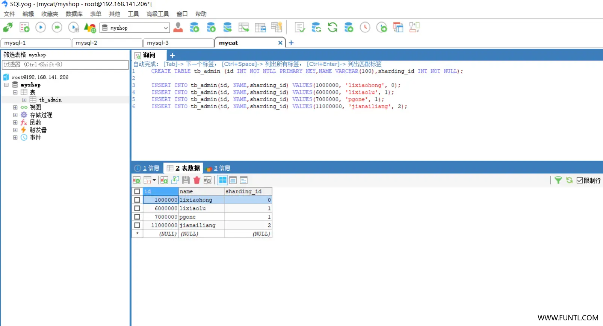

# 分别创建数据库

分别在 3 台 MySQL 数据库上创建 `myshop_1`、`myshop_2`、`myshop_3`，按照刚才创建 MySQL 容器的序号创建

# 通过 MyCat 操作数据库

使用 SQLyog 之类的客户端工具连接 MyCat 数据库，默认端口号为 `8066`




# 创建测试数据

- 建表语句

  ```mysql
  create table tb_admin (id int not null primary key,name varchar(100),sharding_id int not null);
  ```

- 测试数据

  ```mysql
  insert into tb_admin(id, name,sharding_id) values(1000000, 'lixiaohong', 0);
  insert into tb_admin(id, name,sharding_id) values(6000000, 'lixiaolu', 1);
  insert into tb_admin(id, name,sharding_id) values(7000000, 'pgone', 1);
  insert into tb_admin(id, name,sharding_id) values(11000000, 'jianailiang', 2);
  ```

# 检验测试结果

按照上面的配置规则

- `id` 为 `1000000` 的数据应该写入 `dataNode1` 即 `myshop_1`.`tb_admin` 表中
- `id` 为 `6000000` 的数据应该写入 `dataNode2` 即 `myshop_2`.`tb_admin` 表中
- `id` 为 `7000000` 的数据应该写入 `dataNode2` 即 `myshop_2`.`tb_admin` 表中
- `id` 为 `11000000` 的数据应该写入 `dataNode3` 即 `myshop_3`.`tb_admin` 表中

至此这说明分片成功了