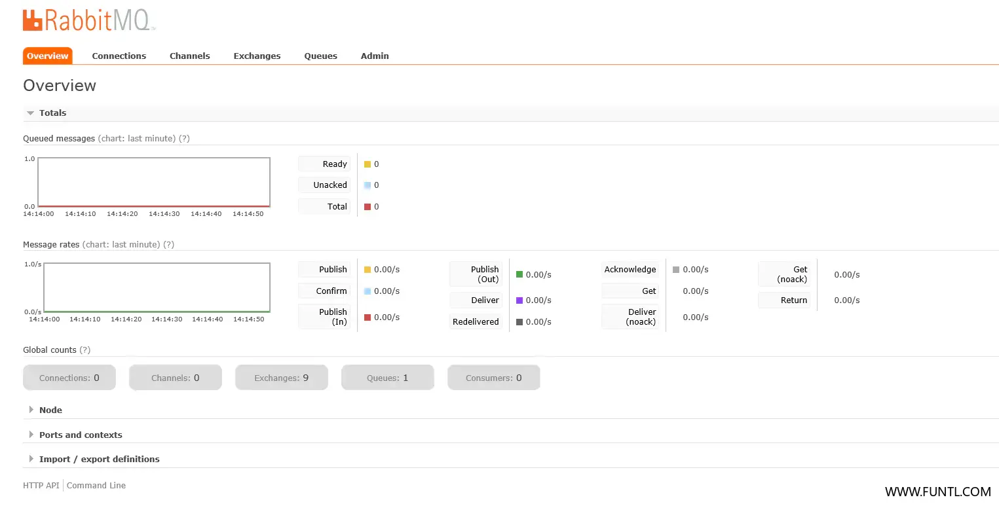
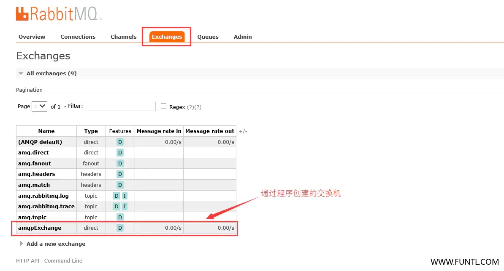
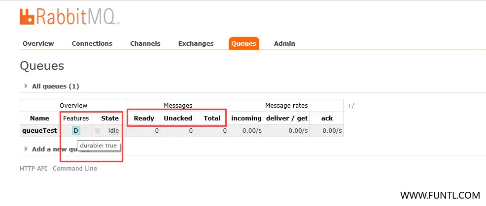

# docker-compose.yml

```yaml
version: '3.1'
services:
  rabbitmq:
    restart: always
    image: rabbitmq:management
    container_name: rabbitmq
    ports:
      - 5672:5672
      - 15672:15672
    environment:
      TZ: Asia/Shanghai
      RABBITMQ_DEFAULT_USER: rabbit
      RABBITMQ_DEFAULT_PASS: 123456
    volumes:
      - ./data:/var/lib/rabbitmq
```

# RabbitMQ WebUI

## 访问地址

http://ip:15672

[ 微服务解决方案之消息队列 ](http://www.qfdmy.com/#/courses/detail/1243241362975891458)


目录


 RabbitMQ 部署 

# docker-compose.yml

```
version: '3.1'
services:
  rabbitmq:
    restart: always
    image: rabbitmq:management
    container_name: rabbitmq
    ports:
      - 5672:5672
      - 15672:15672
    environment:
      TZ: Asia/Shanghai
      RABBITMQ_DEFAULT_USER: rabbit
      RABBITMQ_DEFAULT_PASS: 123456
    volumes:
      - ./data:/var/lib/rabbitmq
```

# RabbitMQ WebUI

## 访问地址

http://ip:15672

## 首页



## Global counts


- Connections：连接数
- Channels：频道数
- Exchanges：交换机数
- Queues：队列数
- Consumers：消费者数

## 交换机页面



## 队列页面



- Name：消息队列的名称，这里是通过程序创建的
- Features：消息队列的类型，durable:true 为会持久化消息
- Ready：准备好的消息
- Unacked：未确认的消息
- Total：全部消息
- 备注：如果都为 0 则说明全部消息处理完成